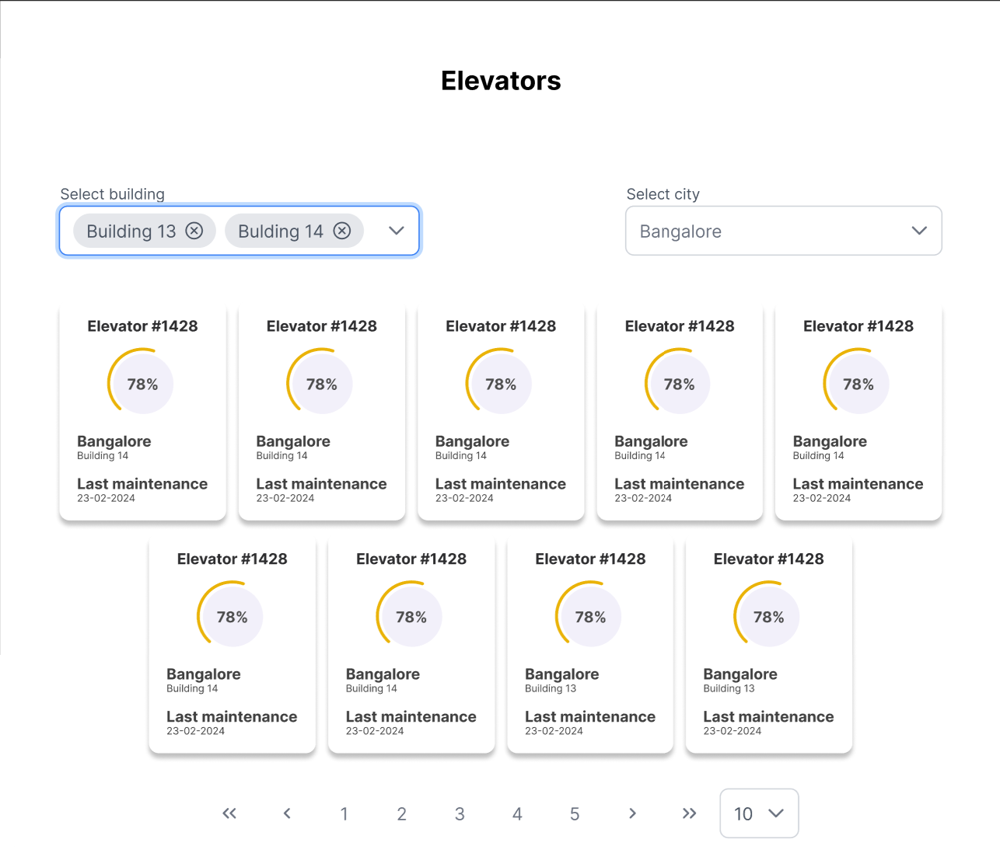
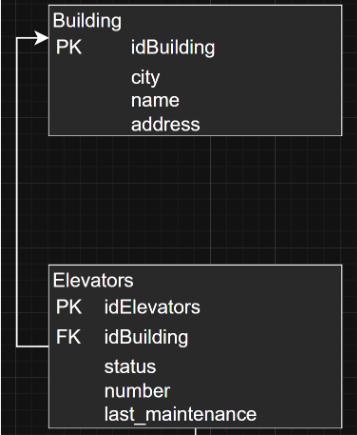

# Elevator Management System - API Endpoints Documentation

## Índice

1. [Módulo Home](#módulo-home)
   - [Elevator List](#elevators-list)
   - [System Overview Panel](#system-overview-panel)
   - [Elevators Status](#elevators-status)
   - [Recommendations](#recommendations)
   - [Alert Remainings](#alert-remainings)
2. [Módulo Lift Details](#módulo-lift-details)
   - [RLU Components](#rlu-components)
   - [3D Lift Visualization](#3d-lift-visualization)
   - [Schedule Maintenance](#schedule-maintenance)
   - [Elevator Report Log](#elevator-report-log)
   - [Real-time Metrics](#real-time-metrics)

---

## Endpoint Structure

Each API endpoint follows a consistent structure, including:

- **Prototype Image**: Visual representation of the endpoint's UI or request/response flow.
- **Database Image**: Diagram showing how the endpoint interacts with the database.
- **Example JSON**: Sample request or response payload.

---

## Módulo Home

### Elevators List

**Home > Elevators List > GET**

<div style="display: flex; align-items: flex-start; gap: 24px;">

<div>

#### Prototype Image  


</div>

<div>

#### Database Image  


</div>

<div>

#### Example JSON
```json
{
  "elevators": [
    {
      "idElevator": "elevator_1428",
      "number": "#1428",
      "status":"operational",
      "last_maintenance": "2024-05-23",
      "building": {
          "id": "building_14",
        "name": "Building 14",
        "city": "Bangalore",
        "address": "Electronic City Phase 1"
      },
    }
  ]
}
```

</div>
</div>

---

### System Overview Panel 
@Díon, Litzy, Keren


<div style="display: flex; align-items: flex-start; gap: 24px;">

<div>

#### Prototype Image  


</div>

<div>

#### Database Image  


</div>

<div>

#### Example JSON
```json
{

}
```

</div>
</div>

---

### Recommendations
@Bernardo, Vale, Josafat

<div style="display: flex; align-items: flex-start; gap: 24px;">

<div>

#### Prototype Image  


</div>

<div>

#### Database Image  


</div>

<div>

#### Example JSON
```json
{

}
```

</div>
</div>

---

### Alert Remainings
@Bernardo, Vale, Josafat


<div style="display: flex; align-items: flex-start; gap: 24px;">

<div>

#### Prototype Image  


</div>

<div>

#### Database Image  


</div>

<div>

#### Example JSON
```json
{

}
```

</div>
</div>

---

## Módulo Lift Details

### RLU Components
@Bernardo, Vale, Litzy


<div style="display: flex; align-items: flex-start; gap: 24px;">

<div>

#### Prototype Image  


</div>

<div>

#### Database Image  


</div>

<div>

#### Example JSON
```json
{
  
}
```

</div>
</div>

---

### Schedule Maintenance


<div style="display: flex; align-items: flex-start; gap: 24px;">

<div>

#### Prototype Image  


</div>

<div>

#### Database Image  


</div>

<div>

#### Example JSON
```json
{

}
```

</div>
</div>

---

### Elevator Report Log
@Díon, Litzy, Vale


<div style="display: flex; align-items: flex-start; gap: 24px;">

<div>

#### Prototype Image  


</div>

<div>

#### Database Image  


</div>

<div>

#### Example JSON
```json
{

}
```

</div>
</div>

---

### Real-time Metrics
@Díon, Litzy, Keren

<div style="display: flex; align-items: flex-start; gap: 24px;">

<div>

#### Prototype Image  


</div>

<div>

#### Database Image  


</div>

<div>

#### Example JSON
```json
{
  
}
```

</div>
</div>

---

_Este documento proporciona una estructura consistente para todos los endpoints del sistema de gestión de elevadores, facilitando la comunicación entre frontend, backend y base de datos._